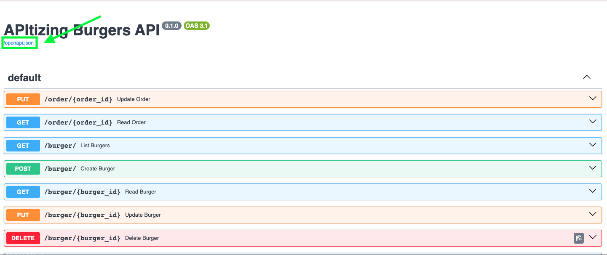

# The Importance of SDKs in the Developer Experience

*In a hurry? Skip to the [Tutorial](#tutorial).*

What do Developer Experience and playing cards have in common? At first glance, the two seem pretty disparate, but for Idan Gazit, senior director of research at GitHub, playing cards are a lesson in the journeys developers undertake when attempting to execute on a task. “Building software is like having a giant house of cards in our brains,” [says Gazit](https://github.blog/2023-06-08-developer-experience-what-is-it-and-why-should-you-care/), “Tiny distractions can knock it over in an instant. DevEx is ultimately about how we contend with that house of cards.”

Not many modern developers can get away without having to make an API call to some sort of external service. While APIs are a powerful developer tool, software development kits – or “SDKs” – help enable seamless integration and as such, are integral to a sophisticated Developer Experience. With so many products and solutions available to developers, an SDK can make or break a customer.

In this tutorial, we will show you how to use FastAPI, OpenAPI, and Speakeasy to create the SDK your developers deserve.

## What is FastAPI?

Based on the open standards for APIs set forth by OpenAPI and JSON Schema, [FastAPI](https://fastapi.tiangolo.com/) is a web framework for building RESTful APIs in Python. Unlike Flask and Django, FastAPI is optimized for developing high-performance APIs with minimal code that takes advantage of standard type hints. Because FastAPI is based on OpenAPI (formerly known as the Swagger Specification), using the framework means baked-in compatibility with other development tools as well as automatic API documentation creation.

Another powerful benefit of building with the OpenAPI standards is the ability to create SDKs and client libraries from a FastAPI application.

## What is OpenAPI?

The [OpenAPI Specification](https://spec.openapis.org/oas/latest.html) (OAS) “defines a standard, programming language-agnostic interface description for HTTP APIs, which allows both humans and computers to discover and understand the capabilities of a service without requiring access to source code, additional documentation, or inspection of network traffic.” In other words, OAS both abstracts away and standardizes how different components of software can interact with each other according to RESTful architecture. The result is a single source of truth for an API that can be used for testing, automation, and creating both code and documentation.

While writing to a specification may seem like a constraint, OpenAPI’s standardization enables more flexibility and a more programmatic approach to API development.

## What is Speakeasy?

[Speakeasy](https://www.speakeasyapi.dev/product/sdks) is on a mission to accelerate innovation by making it radically simple to create and consume APIs. Ever since Stripe launched their transactions API product, APIs have become the defacto method by which B2B companies expose their core functionality. However, even the best APIs can’t overcome a poor developer experience. Speakeasy integrates with some of the most popular API frameworks to deliver production-ready SDKs that empower developers and take APIs to the next level.

Follow along to learn how to create an SDK with FastAPI and Speakeasy.

# Tutorial

In this tutorial, you will use a FastAPI application to generate an OpenAPI spec and then use Speakeasy to create a Python SDK from that spec. 

## Prerequisites

1. Python 3.8+
2. A [Speakeasy account](https://www.speakeasyapi.dev/)
3. Familiarity with [FastAPI](https://fastapi.tiangolo.com/) and the [OpenAPI Specification](https://spec.openapis.org/oas/latest.html)

## Setup

1. Clone the code from the Speakeasy apitizing-burgers repo # TODO: link for this
2. Change directory into the project directory
3. Check out the `tutorial` branch
4. In the project root directory, create a virtual environment: `virtualenv venv`
5. Activate the virtual environment: `source venv/bin/activate`
6. Install FastAPI: `pip install "fastapi[all]"`
7. Install Speakeasy using Homebrew: `brew install speakeasy-api/homebrew-tap/speakeasy`

Now you have everything you need to complete the tutorial.

## A Quick Tour of the Code

This tutorial uses a project built with the FastAPI framework called “apitizing-burgers” that handles burgers and orders. In the project root directory is a directory called `app` where you can find a file called `main.py`. This file is where the application lives.

You will also see a file called `save_openapi.py`. This file is not part of the application and contains helper code for saving and transforming the OpenAPI spec created by FastAPI.

Throughout this tutorial, you will modify the code on the `tutorial` branch of the repo. This code is commented out and indicated with a `TODO` comment for your searching convenience. The `main` branch of this repo contains a finished version of this tutorial.

## Spinning Up the FastAPI Server

1. From the `app` directory, run the following: `​​uvicorn main:app --reload`
2. Navigate to `http://127.0.0.1:8000/docs` where you should see a user interface documenting the apitizing-burgers APIs

## Taking a Look at the OpenAPI Spec

FastAPI gives you an OpenAPI spec out of the box. At `http://127.0.0.1:8000/docs` you should see the linked text `/openapi.json`. Clicking on this link will show you the OpenAPI spec created by FastAPI in (unformatted) JSON.



For a more human readable version of the OpenAPI spec, from the project root directory, run `python app/save_openapi.py`. This will save the specification as a .json file to the root directory.

The spec should look like this:

```
# openapi.json

{
  "openapi": "3.1.0",
  "info": {
    "title": "APItizing Burgers API",
    "version": "0.1.0"
  },
  "paths": {
    "/order/{order_id}": {
      "put": {
        "summary": "Update Order",
        "description": "Update an order",
        "operationId": "update_order_order__order_id__put",
        "parameters": [
          {
            "name": "order_id",
            "in": "path",
            "required": true,
            "schema": {
              "type": "integer",
              "title": "Order ID"
            }
          }
        ],
        ....
```

## Creating an SDK From the OpenAPI Spec

### Add Servers

In order to use Speakeasy to create an SDK from the OpenAPI spec, you need to add servers to the specification since FastAPI doesn’t require this.

1. In `main.py`, locate the line where a FastAPI object is created and uncomment the `servers` argument. This specifies which servers FastAPI should use. To learn more about the FastAPI class, refer to the documentation [here](https://fastapi.tiangolo.com/reference/fastapi/?h=fastapi#fastapi.FastAPI).

```
# main.py

app = FastAPI(
    title="APItizing Burgers API",
    version="0.1.0",
    # TODO: Uncomment the lines below
    # servers=[
    #     {"url": "http://127.0.0.1:8000", "description": "Local server"},
    # ],
    ....
```
2. In `main.py`, locate the `custom_openapi` method that creates the variable `openapi_schema` and uncomment the `servers` argument from the `get_openapi` function. While FastAPI leverages Pydantic models to generate much of the OpenAPI spec, you can override FastAPI's OpenAPI specification by using the  `get_openapi` method. In this example, we create a function called `customize_openapi` that uses `get_openapi()` to get and customize the specification. For the `servers` argument, we are supplying the `servers` we created the FastAPI object with in the code above. To learn more about customizing your OpenAPI spec using FastAPI's overrides, please refer to the documentation [here](https://fastapi.tiangolo.com/how-to/extending-openapi/?h=get_openapi#overriding-the-defaults).
```
# main.py

def custom_openapi():
    """Customize OpenAPI Output"""

    if app.openapi_schema:
        return app.openapi_schema

    openapi_schema = get_openapi(
        version=app.version,
        title=app.title,
        routes=app.routes,
        # TODO: Uncomment the line below
        # servers=app.servers,
        ....
```
3. From the project root directory, run `python app/save_openapi.py` to save an updated version of the spec.

### Validate the OpenAPI Spec

The Speakeasy CLI comes with additional tooling and support to help you create the SDKs your API deserves. To learn more about the Speakeasy CLI, refer to the documentation [here](https://www.speakeasyapi.dev/docs/speakeasy-cli/getting-started).

1. Authenticate with the Speakeasy platform by running `speakeasy auth login`. This will open up a browser window with the Speakeasy login page.
2. Run `speakeasy` from the project root directory to see a list of available commands.
2. Use your arrow keys to navigate to `validate` and press Return to see another list of available commands.
3. Use your arrow keys to navigate to `openapi` and press Return.
4. Now you can provide the filepath to the OpenAPI spec, which in this case should be `./openapi.json`.

This will initialize the Speakeasy OpenAPI validator. If your spec is valid, you should see the following:

```
You can upload your schema to Speakeasy using the following command:

speakeasy api register-schema --schema=./openapi.json

```
(To learn more about registering your schema with the Speakeasy API, refer to the documentation [here](https://www.speakeasyapi.dev/docs/speakeasy-cli/api/register-schema).)

### Generate the Client SDK

With the validity of your OpenAPI spec confirmed, you can now create an SDK.

1. You can either navigate through the Speakeasy CLI menus to select `generate` and follow the prompts or you can run `speakeasy generate sdk --schema ./openapi.json --lang python --out ./sdk`.

Here’s how to interpret that command:

* `speakeasy generate` is the Speakeasy CLI subcommand that initializes the Speakeasy client SDK generation.
* `sdk` is a Speakeasy CLI argument that indicates you want to generate a client SDK from the OpenAPI spec.
* The `--schema` flag indicates where the OpenAPI spec to use is located.
* The `--lang` flag indicates which language you want to create an SDK for.
* The `--out` flag indicates where you want your SDK to be saved.

So in the command `speakeasy generate sdk --schema ./openapi.json --lang python --out ./sdk` you are telling Speakeasy that you would like to generate a Python SDK from the schema found at `./openapi.json` and save it to `./sdk`.

To learn more about the Speakeasy CLI, please refer to the documentation [here](https://www.speakeasyapi.dev/docs/speakeasy-cli/README).

If the generation was successful, you will find a new `sdk/` directory with the docs and code for your new Python SDK.

## A Quick Tour of Your SDK

Congratulations on creating your first SDK with Speakeasy!

In `sdk/src/sdk/sdkconfiguration.py` you can see where the servers you added to the OpenAPI spec are used in the SDK configuration:
```
# sdkconfiguration.py

SERVERS = [
    'http://127.0.0.1:8000',
    # Local server
]
"""Contains the list of servers available to the SDK"""

@dataclass
class SDKConfiguration:
    client: requests.Session
    server_url: str = ''
    server_idx: int = 0
    language: str = 'python'
    openapi_doc_version: str = '0.1.0'
    sdk_version: str = '0.0.1'
    gen_version: str = '2.202.2'
    user_agent: str = 'speakeasy-sdk/python 0.0.1 2.202.2 0.1.0 openapi'
    retry_config: RetryConfig = None

    def get_server_details(self) -> Tuple[str, Dict[str, str]]:
        if self.server_url:
            return utils.remove_suffix(self.server_url, '/'), {}
        if self.server_idx is None:
            self.server_idx = 0

        return SERVERS[self.server_idx], {}
```
Which is how Speakeasy translates the `servers` key in the OpenAPI spec:
```
  # openapi.json
  
  "servers": [
    {
      "url": "http://127.0.0.1:8000",
      "description": "Local server"
    }
  ],
```
In `sdk/src/sdk/sdk.py` you can find the methods your new SDK offers and in `sdk/src/sdk/models/` you can the components and operations used in those methods. You can cross-reference the code with your OpenAPI spec to see how the spec directs the SDK creation. To learn more about the OpenAPI Specification, please refer to the documentation [here](https://swagger.io/specification/).

## Enhancing Your SDK with Customizations

 With the hardest parts of SDK creation handled by Speakeasy, you are free to focus on enhancing the developer experience.

Because developer experience [seeks to](https://microsoft.github.io/code-with-engineering-playbook/developer-experience/) "maximize the amount of time engineers spend on writing code that fulfills story acceptance and done-done criteria," Speakeasy supports a suite of customizations that can help reduce friction and expedite implementation of your SDK. 

### Add More Information to Your SDK

With more documentation in your SDK code, developers can more quickly and easily consume it. You can leverage the FastAPI class to add more information to your SDK. Here's how you can add a summary and description to your SDK:  

1. In `main.py`, locate the line where a FastAPI object is created and uncomment the `summary` and `description` arguments. The process is similar to how you added servers to your specification.
```
# main.py

app = FastAPI(
    title="APItizing Burgers API",
    version="0.1.0",
    # TODO: Uncomment the lines below
    servers=[
        {"url": "http://127.0.0.1:8000", "description": "Local server"},
    ],
    # TODO: Uncomment the lines below
    summary="A simple API to manage burgers and orders",
    description="This API is used to manage burgers and orders in a restaurant",
    ....
```
2. In `main.py`, locate the `custom_openapi` method that creates the variable `openapi_schema` and uncomment the `summary` and `description` arguments from the `get_openapi` function.
```
# main.py

def custom_openapi():
    """Customize OpenAPI Output"""

    if app.openapi_schema:
        return app.openapi_schema

    openapi_schema = get_openapi(
        version=app.version,
        title=app.title,
        routes=app.routes,
        # TODO: Uncomment the line below
        servers=app.servers,
        # TODO: Uncomment the lines below
        summary=app.summary,
        description=app.description,
        ....
```

### Customize Your SDK Method Names

If you look inside your new Python SDK in `/src/sdk/sdk.py`, you will notice methods with redundant names such as `​​create_burger_burger_post`: 

```
# sdk.py

def create_burger_burger_post(self, request: components.BurgerCreate) -> operations.CreateBurgerBurgerPostResponse:
        r"""Create Burger
        Create a burger
        """
        ....
```
And in the OpenAPI spec, you will see:
```
# openapi.json

      "post": {
        "summary": "Create Burger",
        "description": "Create a burger",
        "operationId": "create_burger_burger__post",
        ....
```
This is because when generating the OpenAPI spec, FastAPI uses a default naming pattern to ensure unique operation IDs for the different operations defined in the code:
```
# main.py

def create_burger(burger: BurgerCreate):
    """Create a burger"""

    burger_data = BurgerData(
        id=len(burgers_db),
        **burger.dict(),
    )

    burgers_db.append(burger_data)
    return BurgerOutput(**burger_data.dict())
    ....
```

While these IDs are indeed unique, they do not result in the most user-friendly method names. Fortunately, you can customize how these IDs are generated.

The best way to do this is taking advantage of FastAPI’s `generate_unique_id_function` parameter.

1. In `main.py`, locate the line where a FastAPI object is created and uncomment the `generate_unique_id_function` argument. Now, instead of the default naming convention, FastAPI will use the `custom_generate_unique_id_function` method to format the operation IDs.

```
# main.py

app = FastAPI(
    title="APItizing Burgers API",
    version="0.1.0",
    # TODO: Uncomment the lines below
    servers=[
        {"url": "http://127.0.0.1:8000", "description": "Local server"},
    ],
    # TODO: Uncomment the lines below
    summary="A simple API to manage burgers and orders",
    description="This API is used to manage burgers and orders in a restaurant",
    # TODO: Uncomment the line below
    generate_unique_id_function=custom_generate_unique_id_function,
    ....
```
```
# main.py

def convert_snake_case_to_camel_case(string: str) -> str:
    """Convert snake case to camel case"""

    words = string.split("_")
    return words[0] + "".join(word.title() for word in words[1:])


def custom_generate_unique_id_function(route: APIRoute) -> str:
    """Custom function to generate unique id for each endpoint"""

    return convert_snake_case_to_camel_case(route.name)
```

### Recreate Your SDK

Now let's see how these changes are reflected in your SDK.

1. From the project root directory, run `python app/save_openapi.py` to overwrite the `openapi.json` file.
2. Run the Speakeasy SDK generation command again: `speakeasy generate sdk --schema ./openapi.json --lang python --out ./sdk`.

Now check the method names in the SDK. The redundancy should be gone, replaced by method names that are a lot more user-friendly:

```
# sdk.py

def create_burger(self, request: components.BurgerCreate) -> operations.CreateBurgerResponse:
        r"""Create Burger
        Create a burger
        """
        base_url = utils.template_url(*self.sdk_configuration.get_server_details())
```

Additionally, the SDK now contains a summary and description:

```
# sdk.py

class SDK:
    r"""APItizing Burgers API: A simple API to manage burgers and orders
    This API is used to manage burgers and orders in a restaurant
    """
``` 

Now the developer experience of your SDK is a lot more intuitive.

## Further Enhancing Your SDK for Both Machines and Humans

### Group Operations Together

You can use `tags` to group operations together to reflect the separation of duties in your code in your OpenAPI spec and in your SDK.

1. In `main.py`, search for the commented-out `tags` and uncomment them. Each route will have one: 

```
# main.py

@app.post(
    "/burger/",
    response_model=BurgerOutput,
    status_code=status.HTTP_201_CREATED,
    # TODO: Uncomment the line below
    # tags=["burger"],
    ....

@app.get(
    "/burger/",
    response_model=List[BurgerOutput],
    # TODO: Uncomment the line below
    # tags=["burger"],
    ....
```

With these tags, your OpenAPI spec and your SDK will now be grouped into operations that involve burgers and operations that involve orders.

1. Generate a new spec by running `python app/save_openapi.py`.
2. Re-run `speakeasy generate sdk --schema ./openapi.json --lang python --out ./sdk` to create a new SDK.

You should notice that now you have a file called `sdk/src/sdk/burger.py` that contains the operations related to burgers and a file called `sdk/src/sdk/order.py` that contains the operations related to orders.

### Add Metadata to Your Tags

You can take this one step further by adding metadata to your tags.

1. In `main.py`, uncomment the `openapi_tags` parameter passed into the FastAPI class.
```
# main.py

app = FastAPI(
    title="APItizing Burgers API",
    version="0.1.0",
    # TODO: Uncomment the lines below
    servers=[
        {"url": "http://127.0.0.1:8000", "description": "Local server"},
    ],
    # TODO: Uncomment the lines below
    summary="A simple API to manage burgers and orders",
    description="This API is used to manage burgers and orders in a restaurant",
    # TODO: Uncomment the line below
    generate_unique_id_function=custom_generate_unique_id_function,
    # TODO: Uncomment the line below
    openapi_tags=tags_metadata,
)
```
```
# main.py

tags_metadata = [
    {
        "name": "burger",
        "description": "Operations related to burgers",
        "externalDocs": {
            "description": "Burger external docs",
            "url": "https://en.wikipedia.org/wiki/Hamburger",
        },
    },
    {
        "name": "order",
        "description": "Operations related to orders",
    },
]
```
2. In `main.py`, locate the `custom_openapi` method that creates the variable `openapi_schema` and uncomment the `openapi_tags` argument from the `get_openapi` function.
```
# main.py

def custom_openapi():
    """Customize OpenAPI Output"""

    if app.openapi_schema:
        return app.openapi_schema

    openapi_schema = get_openapi(
        version=app.version,
        title=app.title,
        routes=app.routes,
        # TODO: Uncomment the line below
        servers=app.servers,
        # TODO: Uncomment the lines below
        summary=app.summary,
        description=app.description,
        # TODO: Uncomment the line below
        tags=app.openapi_tags,
    )
``` 
3. Generate a new spec by running `python app/save_openapi.py`.
4. Re-run `speakeasy generate sdk --schema ./openapi.json --lang python --out ./sdk` to create a new SDK.

Now the `Burger` and `Order` SDK classes should contain more information:
```
# burger.py

class Burger:
    r"""Operations related to burgers
    https://en.wikipedia.org/wiki/Hamburger - Burger external docs
    """
    ....
```
```
# order.py

class Order:
    r"""Operations related to orders"""
```

Tags are a really powerful way to help organize your endpoints and enable users to get up and running with your SDK more quickly and efficiently. Learn more about OpenAPI tagging best practices [here](https://www.speakeasyapi.dev/post/tags-best-practices-in-openapi).

## Speakeasy OpenAPI Extensions

So far, these customizations leverage the OpenAPI functionality within FastAPI, but Speakeasy enables you to add even more to your SDK via OpenAPI extensions.

### Add Retries Globally and Per Route

With Speakeasy, you can customize how your SDK handles retrying failed requests. You can do this on both a global and route level. Both options use FastAPI's concept of OpenAPI Extensions. To learn more, please refer to the documentation [here](https://fastapi.tiangolo.com/advanced/path-operation-advanced-configuration/?h=extension#openapi-extensions).

1. To add retries globally, in `main.py`, locate the `custom_openapi` method that creates the variable `openapi_schema` and uncomment the block of code that adds the `x-speakeasy-retries` key and value to the `openapi_schema` object.
```
# main.py

    # TODO: Uncomment the lines below
    openapi_schema["x-speakeasy-retries"] = {
        "strategy": "backoff",
        "backoff": {
            "initialInterval": 500,
            "maxInterval": 60000,
            "maxElapsedTime": 3600000,
            "exponent": 1.5,
        },
        "statusCodes": [
            "5XX",
        ],
        "retryConnectionErrors": True,
    }
    ....
```   
2. To add retries to the `get` route, in `main.py`, locate the route that gets a burger and uncomment the `openapi_extra` argument.
```
# main.py

@app.get(
    "/burger/",
    response_model=List[BurgerOutput],
    # TODO: Uncomment the line below
    tags=["burger"],
    # TODO: Uncomment the lines below
    openapi_extra={
        "x-speakeasy-retries": {
            "strategy": "backoff",
            "backoff": {
                "initialInterval": 500,
                "maxInterval": 60000,
                "maxElapsedTime": 3600000,
                "exponent": 1.5,
            },
            "statusCodes": [
                "5XX",
            ],
            "retryConnectionErrors": True,
        }
    },
)
```

### Override Method Names

You can use the `x-speakeasy-name-override` extension to match on and override naming patterns.

In this example, you will override all instances of “read” in the SDK method names to “fetch” using Speakeasy.

1. To add a name override globally, in `main.py`, locate the `custom_openapi` method that creates the variable `openapi_schema` and uncomment the block of code that adds the `x-speakeasy-name-override` key and value to the `openapi_schema` object.

```
# main.py

# TODO: Uncomment the lines below
    openapi_schema["x-speakeasy-name-override"] = [{
        "operationId": "^read.*",
        "methodNameOverride": "fetch",
    }]
    ....
```

By adding this, you are telling Speakeasy to use a regular expression to replace operation IDs that match the expression to the value specified for `methodNameOverride` – which, in this case, is “fetch.”

To see your changes in your SDK:

1. Generate a new spec by running `python app/save_openapi.py`.
2. Re-run `speakeasy generate sdk --schema ./openapi.json --lang python --out ./sdk` to create a new SDK.

You should now see retries in your SDK as well as the method name override.

```
# burger.py

def fetch(self, burger_id: int, retries: Optional[utils.RetryConfig] = None) -> operations.ReadBurgerResponse:
        r"""Read Burger
        Read a burger
        """
```

Similarly, you should now see the retry configuration present in your SDK globally:

```
# sdk.py

global_retry_config = self.sdk_configuration.retry_config
        retry_config = retries
        if retry_config is None:
            if global_retry_config:
                retry_config = global_retry_config
            else:
                retry_config = utils.RetryConfig('backoff', utils.BackoffStrategy(500, 60000, 1.5, 3600000), True)
```
And in the specific route you added retries to:

```
# burger.py

global_retry_config = self.sdk_configuration.retry_config
        retry_config = retries
        if retry_config is None:
            if global_retry_config:
                retry_config = global_retry_config
            else:
                retry_config = utils.RetryConfig('backoff', utils.BackoffStrategy(600, 60000, 1.5, 3600000), True)
```
Speakeasy supports a suite of SDK customizations. To learn more about how to customize your SDK, please refer to the documentation [here](https://www.speakeasyapi.dev/docs/customize-sdks).

To learn more about integrating Speakeasy with FastAPI -- such as adding security, additional responses to routes, and webhooks -- please refer to the documentation [here](https://www.speakeasyapi.dev/docs/api-frameworks/fastapi).

## But That’s Just the Beginning …

Speakeasy can not only create your SDKs, we can manage them too. With a Speakeasy managed SDK, you can focus your engineering resources on product development. Speakeasy helps you deliver value to your customers quickly by providing the SDKs that enable developers to seamlessly integrate your product.  

All you need is an OpenAPI spec. Let Speakeasy do the rest.

To learn more about Speakeasy, check out our documentation [here](https://www.speakeasyapi.dev/docs). To speak with someone on the team, get in touch with us [here](https://www.speakeasyapi.dev/contact).